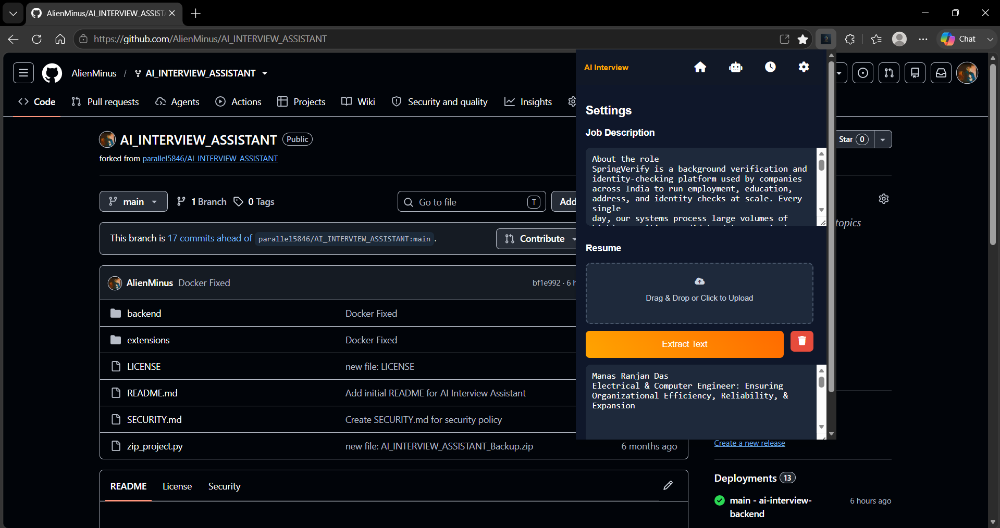

# 🤖 AI Interview Assistant

An AI-powered browser extension designed to help users **practice technical and non-technical interviews**, analyze resumes against job descriptions, generate interview questions, evaluate answers, provide voice interaction, and detect potential cheating indicators using the webcam.

---

## 📌 Overview

**AI Interview Assistant** combines a browser extension frontend with a Python/Flask backend and machine-learning components to create an interactive interview-practice environment.

The system allows a candidate to:

- 📄 Upload and extract text from resumes
- 💼 Enter a target job description
- 🤖 Analyze resume–job-description compatibility
- 📊 Generate a match score and identify missing skills
- ❓ Generate technical and non-technical interview questions
- ⏱️ Answer questions under a timed interview environment
- 🎙️ Use speech recognition for voice-based answers
- 🔊 Hear questions through text-to-speech
- 📷 Use webcam-based monitoring during interviews
- 👁️ Run cheating-detection functionality
- 🧠 Evaluate candidate answers using NLP
- 📈 Track interview scores and history
- 📊 Visualize performance through a dashboard
- 🐳 Run the backend inside Docker

---

## 🎬 Project Demo

### 🖥️ Interface Preview

<p align="center">
  
</p>

<p align="center">
  <em>AI Interview Assistant — Dashboard, Interview, Results, History & Settings</em>
</p>

### 🎥 Demo Video

<p align="center">
  <video
    src="assets/demo.mp4"
    controls
    width="100%"
  >
    Your browser does not support the video tag.
  </video>
</p>

> 📌 **Demo:** The video demonstrates resume analysis, AI-generated interview questions, camera monitoring, voice input, answer evaluation, scoring, and interview history.

---

# ✨ Features

## 📄 Resume Analysis

Upload a candidate's resume in supported document formats and extract its text through the backend.

```text
Resume
   ↓
Text Extraction
   ↓
NLP Analysis
   ↓
Job Description Comparison
   ↓
Match Score + Missing Skills
```

## 💼 Job Description Matching

The system analyzes the relationship between:

- Candidate resume
- Target job description
- Relevant keywords
- Skills

---

## 🤖 AI Interview Question Generation

After resume analysis, the backend generates interview questions relevant to the candidate.

Questions are divided into:

```text
ROUND 1
Technical

ROUND 2
Non-Technical
```

---

## ⏱️ Timed Interviews

Each question has a **2-minute timer**.

```text
Time Left: 1:59
```

---

## 🎙️ Voice-Based Answering

The extension supports browser speech recognition and converts spoken responses into text.

---

## 🔊 Text-to-Speech

Interview questions can be read aloud using:

```javascript
SpeechSynthesisUtterance
```

---

## 📷 Camera Monitoring

The extension requests webcam access when an interview starts.

The camera system:

- Requests video independently from microphone access
- Displays a live camera preview
- Handles camera permission errors
- Detects unavailable cameras
- Handles cameras already being used by another application
- Attempts to avoid known virtual/Phone Link cameras
- Releases camera tracks when the interview ends

Camera and microphone access are intentionally handled separately.

---

## 👁️ Cheating Detection

The application includes webcam-based cheating-detection functionality intended to identify suspicious interview behavior.

Detected incidents are tracked during the interview and displayed in interview history.

---

## 📊 Interview Dashboard

The extension maintains interview history using browser extension storage.

The dashboard tracks:

- Total interviews
- Average score
- Previous interview scores
- Cheating alerts

A Chart.js-based visualization displays recent performance.

---

## 📚 Interview History

Previous interviews are stored locally and displayed with:

```text
Date
Score
Cheating Alerts
```

---

# 🏗️ System Architecture

```text
                     AI INTERVIEW ASSISTANT
                              │
                 ┌────────────┴────────────┐
                 │                         │
                 ▼                         ▼
        Browser Extension             Flask Backend
                 │                         │
        ┌────────┼────────┐          ┌─────┼──────────────┐
        │        │        │          │     │              │
        ▼        ▼        ▼          ▼     ▼              ▼
     Resume   Interview  Camera     NLP   ML Models    External APIs
     Upload   Interface  + Audio    │
        │        │        │         ├── KeyBERT
        │        │        │         ├── Sentence Transformers
        │        │        │         ├── Scikit-learn
        │        │        │         └── Ultralytics
        │        │        │
        └────────┴────────┘
                 │
                 ▼
          Browser Storage
```

---

# 🛠️ Technology Stack

## Frontend / Browser Extension

- HTML5
- CSS3
- JavaScript
- Chrome/Edge Extension Manifest V3
- Chrome Storage API
- Web Speech API
- MediaDevices API
- Chart.js

## Backend

- Python 3.12
- Flask
- Flask-CORS
- Waitress
- python-dotenv

## Artificial Intelligence / Machine Learning

- PyTorch
- Sentence Transformers
- KeyBERT
- Scikit-learn
- NumPy
- Ultralytics
- OpenCV

## Document Processing

- `python-docx`
- `pypdf`

## External Services

- RapidAPI
- Hugging Face

## Deployment

- Docker
- Docker Desktop
- Python virtual environment
- Linux-based Python Docker image

---

# 📁 Project Structure

A typical project structure is:

```text
AI_INTERVIEW_ASSISTANT/
│
├── backend/
│   ├── Dockerfile
│   ├── requirements.txt
│   ├── main.py
│   ├── nlp_engine.py
│   ├── cheating_detection.py
│   ├── question_generator.py
│   ├── scoring.py
│   ├── model/
│   ├── data/
│   └── .env
│
├── assets/
│   └── image.png
│
├── popup.html
├── popup.js
├── style.css
├── background.js
├── manifest.json
│
└── README.md
```

> The exact project structure may vary depending on the current version of the project.

---

# ⚙️ Backend Setup

## 1. Clone the Repository

```bash
git clone <YOUR_REPOSITORY_URL>
cd AI_INTERVIEW_ASSISTANT
```

## 2. Navigate to Backend

```bash
cd backend
```

## 3. Create a Python Virtual Environment

### Windows

```powershell
python -m venv .venv
```

Activate it:

```powershell
.venv\Scripts\activate
```

### Linux/macOS

```bash
python3 -m venv .venv
source .venv/bin/activate
```

## 4. Install Dependencies

```bash
pip install -r requirements.txt
```

---

# 🔐 Environment Variables

Create:

```text
backend/.env
```

Add the required API credentials:

```env
RAPID_API_KEY=your_rapidapi_key
HF_TOKEN=your_huggingface_token
```

### ⚠️ Security

**Never commit `.env` to GitHub.**

Add:

```gitignore
.env
```

to `.gitignore`.

Also make sure `.env` is excluded from the Docker build context using `.dockerignore`.

---

# ▶️ Running the Backend Locally

From the `backend` directory:

```bash
python main.py
```

The backend is configured around:

```text
http://localhost:5000
```

The browser extension communicates with backend endpoints such as:

```text
POST /extract-text
POST /analyze
POST /evaluate
```

---

# 🐳 Docker Deployment

## Build the Docker Image

From the `backend/` directory:

```powershell
docker build -t interview-assistant:v1 .
```

## Verify the Image

```powershell
docker images
```

You should see:

```text
interview-assistant    v1
```

## Run the Container

Pass environment variables at runtime:

```powershell
docker run --rm --env-file .env -p 5000:5000 interview-assistant:v1
```

The application will then be accessible through:

```text
http://localhost:5000
```

### Why use `--env-file`?

API credentials should **not** be embedded inside the Docker image.

```text
.env
 │
 ▼
docker run --env-file .env
 │
 ▼
Docker Container
 │
 ├── RAPID_API_KEY
 └── HF_TOKEN
```

---

# 🧪 Testing Docker

To verify that Docker itself is functioning:

```powershell
docker run hello-world
```

A successful installation produces:

```text
Hello from Docker!
```

Inspect the project image with:

```powershell
docker image inspect interview-assistant:v1
```

---

# 🧩 Browser Extension Installation

## Microsoft Edge

Open:

```text
edge://extensions/
```

Enable:

```text
Developer mode
```

Select:

```text
Load unpacked
```

and choose the project directory containing `manifest.json`.

## Google Chrome

Open:

```text
chrome://extensions/
```

Enable:

```text
Developer mode
```

Click:

```text
Load unpacked
```

and select the extension directory.

---

# 🔑 Extension Permissions

The extension uses Manifest V3.

Relevant permissions include:

```json
{
  "permissions": [
    "storage",
    "notifications",
    "tabs",
    "activeTab",
    "scripting"
  ]
}
```

The local backend is permitted through:

```json
"host_permissions": [
  "http://localhost:5000/*"
]
```

along with the project's configured external services.

---

# 🔄 Interview Workflow

```text
Launch Extension
       │
       ▼
Enter Job Description
       │
       ▼
Upload Resume
       │
       ▼
Extract Resume Text
       │
       ▼
Save Candidate Profile
       │
       ▼
Start Interview
       │
       ▼
Camera Permission
       │
       ▼
Resume + JD Analysis
       │
       ▼
Match Score
       │
       ▼
Missing Skills
       │
       ▼
Generate Questions
       │
       ▼
Technical Round
       │
       ▼
Non-Technical Round
       │
       ▼
Voice / Text Answer
       │
       ▼
Answer Evaluation
       │
       ▼
Score Calculation
       │
       ▼
Cheating Detection
       │
       ▼
Final Score
       │
       ▼
Save Interview History
       │
       ▼
Dashboard
```

---

# 📡 Backend API

## Extract Resume Text

```http
POST /extract-text
```

Used to extract text from uploaded resume documents.

## Analyze Resume

```http
POST /analyze
```

Example request:

```json
{
  "resume": "Candidate resume text...",
  "job_description": "Job description..."
}
```

Example response structure:

```json
{
  "score": 85,
  "missing_skills": [],
  "questions": []
}
```

## Evaluate Answer

```http
POST /evaluate
```

Example request:

```json
{
  "candidate_answer": "Candidate's answer...",
  "reference_answer": "Expected/reference answer..."
}
```

The resulting score contributes to the candidate's final interview score.

---

# 🎯 Interview Scoring

The application maintains:

```javascript
interviewState.totalScore
```

and accumulates scores obtained from individual answers.

At the end:

```text
Final Score: XX/100
```

is displayed and stored in interview history.

---

# 🛡️ Security Considerations

This project handles potentially sensitive information including:

- Resume data
- Job descriptions
- API credentials
- Camera access
- Microphone access
- Interview performance data

### Never commit

```text
.env
API keys
HF tokens
private credentials
```

### Never hard-code

```javascript
const HF_TOKEN = "...";
const RAPID_API_KEY = "...";
```

### Prefer

```powershell
docker run --env-file .env ...
```

for local Docker execution.

---

# 📷 Camera & Microphone Permissions

The camera and microphone are intentionally handled independently.

### Camera

```javascript
navigator.mediaDevices.getUserMedia({
    video: true,
    audio: false
});
```

### Microphone

```javascript
navigator.mediaDevices.getUserMedia({
    audio: true
});
```

This prevents microphone permission failure from incorrectly appearing as a camera failure.

The camera implementation handles common errors such as:

```text
NotAllowedError
NotFoundError
NotReadableError
OverconstrainedError
SecurityError
AbortError
```

---

# 🐛 Troubleshooting

## Docker daemon unavailable

If you see:

```text
failed to connect to the docker API
```

start Docker Desktop and verify:

```powershell
docker info
```

## Docker image build fails while installing PyTorch

The project uses a CPU-oriented PyTorch installation for the Docker environment.

Rebuild with:

```powershell
docker build --no-cache -t interview-assistant:v1 .
```

## Camera access denied

Check:

1. Browser camera permissions
2. Windows camera permissions
3. Whether another application is using the webcam
4. Extension permissions
5. Extension reload after modifying `manifest.json`

Inspect the extension console for the actual DOMException:

```text
NotAllowedError
NotFoundError
NotReadableError
```

rather than relying on a generic camera error.

## Backend returns HTML instead of JSON

The extension expects JSON responses from the backend.

If you see:

```text
Server returned HTML
```

verify that:

```text
http://localhost:5000
```

is reachable and that the backend is running.

For Docker:

```powershell
docker ps
```

---

# 📌 Docker Configuration

The backend Docker image uses:

```dockerfile
FROM python:3.12-slim
```

and exposes:

```dockerfile
EXPOSE 5000
```

The container starts with:

```dockerfile
CMD ["python", "-u", "main.py"]
```

The Docker environment installs CPU-oriented PyTorch rather than unnecessarily pulling the CUDA dependency stack.

---

# 🚧 Future Improvements

Potential future enhancements include:

- 🎥 Dedicated interview tab instead of relying entirely on the extension popup
- 🧠 Improved LLM-based answer evaluation
- 👤 Face detection and multi-person detection
- 👀 Advanced gaze/posture analysis
- 📊 More detailed interview analytics
- 📈 Skill-wise performance tracking
- ☁️ Cloud-based interview history
- 🔐 Improved secret management for production
- ⚡ Docker image size optimization
- 🧪 Automated backend and extension tests
- 🚀 Production deployment of the Flask backend
- 📱 Responsive interview interface
- 🗣️ Improved multilingual speech recognition

---

# 🎯 Project Objective

The project aims to provide an accessible environment where students and job seekers can **practice interviews independently**, receive AI-assisted feedback, and improve their technical and communication skills through repeated practice.

---
# 👨‍💻 Author

**Barsharani Gochhayat**

B.Tech — Computer Science & Engineering

Raajdhani Engineering College, Bhubaneswar
Biju Patnaik University of Technology (BPUT), Odisha

# 👨‍💻 Co-Author

**Manas Ranjan Das**

B.Tech — Electrical & Computer Engineering

Ajay Binay Institute of Technology (ABIT), Cuttack
Biju Patnaik University of Technology (BPUT), Odisha

---

# 📜 License

```text
MIT License
```

If this is an academic/project submission, you can instead specify the institutional or project-specific licensing terms.

---

# ⭐ Contributing

Contributions, suggestions, bug reports, and feature requests are welcome.

```text
Fork Repository
      ↓
Create Feature Branch
      ↓
Implement Changes
      ↓
Test Locally
      ↓
Commit Changes
      ↓
Push Branch
      ↓
Create Pull Request
```

---

# ⭐ Support

If you find this project useful, consider giving the repository a ⭐ and contributing improvements, bug fixes, and new interview features.
